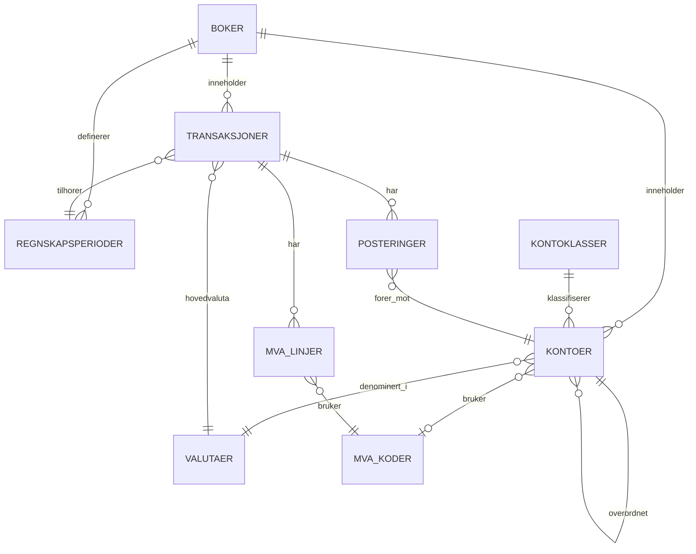

# Rapport

---

Denne rapporten dokumenterer arbeidet utført i DATA1500 og gir en oversikt over løsninger, analyser og refleksjoner knyttet til oppgavene.

---

### 🔹 Innledning

I dette prosjektet har jeg jobbet med en rekke oppgaver knyttet til databaser, med fokus på datamodellering, transaksjoner, ytelse, sikkerhet og moderne systemarkitektur. Gjennom oppgavene har jeg brukt PostgreSQL som relasjonsdatabase, samt teknologier som Redis og MongoDB for caching og staging.

Målet med prosjektet har vært å oppnå en praktisk forståelse av hvordan databaser fungerer i virkelige systemer, og hvordan ulike teknologier kan kombineres for å lage robuste, effektive og skalerbare løsninger.

Oppgavene bygger på hverandre, fra grunnleggende datamodellering og normalisering til mer avanserte temaer som samtidighet, feilhåndtering, ytelsesoptimalisering og ETL-pipeliner.

---

## Oppgave 1: Implementasjon av datamodellen, mermaid-diagrammet og normalform

### Del B – Mermaid-diagram

Mermaid-kode:



---

### 🔹 Del C – Hvorfor modellen er i 3NF

Denne datamodellen er i tredje normalform (3NF) fordi hver tabell har en tydelig primærnøkkel, og alle ikke-nøkkelattributter er fullt avhengige av hele primærnøkkelen. Kolonnene i tabellene beskriver kun den entiteten tabellen representerer, og det finnes ingen unødige gjentakelser av data.

Modellen oppfyller først 1NF fordi alle attributter er atomiske. Hver kolonne inneholder én verdi av én type, og det finnes ingen repeterende grupper eller lister i samme felt.

Videre oppfyller modellen 2NF fordi sammensatte sammenhenger er løst gjennom egne tabeller og fremmednøkler. Dette gjør at attributter ikke bare er delvis avhengige av en del av en nøkkel. I praksis brukes hovedsakelig surrogate primærnøkler (GUID), noe som gjør at de øvrige attributtene er avhengige av hele nøkkelen.

Til slutt er modellen i 3NF fordi det ikke finnes transitive avhengigheter mellom ikke-nøkkelattributter. For eksempel lagres informasjon om kontoklasser i tabellen *Kontoklasser*, mens *Kontoer* kun refererer til denne via en fremmednøkkel. På samme måte lagres valutainformasjon i *Valutaer*, MVA-regler i *MVA_koder*, og periodedata i *Regnskapsperioder*.

Dette gjør at modellen unngår duplisering av data, og den blir både enklere å vedlikeholde og mindre utsatt for oppdateringsfeil.

---

### 🔹 Konklusjon

Oppgaven viser hvordan en godt strukturert datamodell kan oppnå høy datakvalitet gjennom normalisering. Ved å følge prinsippene for 1NF, 2NF og 3NF blir databasen mer konsistent og robust.

Jeg forenkler kanskje litt, men det virker ganske tydelig at en slik struktur gjør systemet lettere å jobbe med over tid, samtidig som det reduserer risikoen for feil i dataene.


---

## Oppgave 5: Ytelsesanalyse med EXPLAIN ANALYZE og MATERIALIZED VIEW

I denne oppgaven ble ytelsen til databaseforespørsler analysert ved hjelp av `EXPLAIN ANALYZE`. Dette verktøyet gir innsikt i hvordan PostgreSQL faktisk utfører en spørring, inkludert hvilke operasjoner som brukes og hvor lang tid de tar.

---

### 🔹 Analyse med EXPLAIN ANALYZE

Følgende spørring ble analysert:

```sql
EXPLAIN ANALYZE
SELECT *
FROM "Posteringer"
WHERE konto_guid = 'KONTO00000000000000000000001920';
```

Resultatet viser hvordan databasen utfører spørringen, for eksempel om den bruker:

* **Seq Scan (sekvensielt søk)** – mindre effektivt ved store datamengder
* **Index Scan** – mer effektivt når indekser er tilgjengelige

I vårt tilfelle viste `EXPLAIN ANALYZE` at spørringen brukte **Seq Scan** før indeksen ble opprettet, og **Index Scan** etterpå.

For å forbedre ytelsen ble det opprettet en indeks:

```sql
CREATE INDEX idx_posteringer_konto_guid
ON "Posteringer"(konto_guid);
```

Dette gjør at spørringer som filtrerer på `konto_guid` kan utføres raskere.

---

### 🔹 Bruk av MATERIALIZED VIEW

For å forbedre ytelsen ved gjentatte beregninger ble det brukt en **MATERIALIZED VIEW**. Denne lagrer resultatet av en spørring fysisk i databasen.

I motsetning til en vanlig VIEW, lagrer en MATERIALIZED VIEW resultatene fysisk, noe som gir bedre ytelse ved gjentatte spørringer.

Eksempel:

```sql
CREATE MATERIALIZED VIEW saldo_per_konto AS
SELECT
    k.kontonummer,
    k.navn,
    SUM(p.belop_teller::numeric / p.belop_nevner) AS saldo
FROM "Kontoer" k
LEFT JOIN "Posteringer" p
    ON p.konto_guid = k.guid
GROUP BY k.kontonummer, k.navn;
```

Denne viewen beregner saldo per konto og lagrer resultatet slik at det ikke må beregnes på nytt hver gang.

For å oppdatere viewen når data endres brukes:

```sql
REFRESH MATERIALIZED VIEW saldo_per_konto;
```

---

### 🔹 Konklusjon

Ved å bruke `EXPLAIN ANALYZE` kan man identifisere ytelsesproblemer og forbedre spørringer ved hjelp av indeksering.

MATERIALIZED VIEW er nyttig for å forbedre ytelsen på komplekse spørringer som brukes ofte, ved å lagre ferdig beregnede resultater i databasen.

Jeg forenkler kanskje litt, men det virker ganske tydelig at ytelsen kan forbedres både gjennom indeksering og ved bruk av materialiserte visninger, siden dette reduserer behovet for tunge beregninger hver gang spørringen kjøres.


--- 

## Oppgave 6: Databaseadministrasjon og tilgangskontroll

I denne oppgaven ble det implementert en sikkerhetsmodell i PostgreSQL ved hjelp av roller, brukere, `GRANT`/`REVOKE` og Row Level Security (RLS).

Det ble opprettet fire roller:

* `regnskap_admin` med full tilgang til alle tabeller
* `revisor` med kun lesetilgang (`SELECT`) til alle tabeller
* `regnskapsforer` med lesetilgang til alle tabeller, samt `INSERT` og `UPDATE` på `Transaksjoner`, `Posteringer` og `MVA-linjer`
* `les_tilgang` med begrenset lesetilgang til oppslagstabellene `Kontoer`, `Kontoklasser` og `Valutaer`

I tillegg ble det opprettet fire brukere som ble tilordnet disse rollene:

* `dba_ola` → `regnskap_admin`
* `revisor_kari` → `revisor`
* `bokforer_per` → `regnskapsforer`
* `ekstern_revisor` → `les_tilgang`

---

### 🔹 Forskjellen mellom ROLE og USER

I PostgreSQL er en USER egentlig en rolle med innloggingsrettigheter (LOGIN). En `ROLE` kan være enten en ren rolle (uten login) eller en bruker. Dette gjør det mulig å skille mellom identitet (bruker) og rettigheter (rolle).

---

### 🔹 Hvorfor bruke roller i stedet for direkte rettigheter

Det er god praksis å gi rettigheter til roller i stedet for direkte til brukere. Dette gjør systemet mer fleksibelt og enklere å administrere.

Hvis en ny ansatt trenger samme tilgang som en eksisterende bruker, holder det å tildele samme rolle, uten å måtte skrive mange nye `GRANT`-kommandoer.

---

### 🔹 Prinsippet om minste privilegium

Prinsippet om minste privilegium (Principle of Least Privilege) ble brukt ved å gi hver rolle kun de rettighetene som er nødvendige:

* `regnskapsforer` kan ikke slette data
* `ekstern_revisor` har ikke tilgang til sensitive tabeller som `Transaksjoner`
* kun `regnskap_admin` har full kontroll

Dette reduserer risikoen for feil og uautorisert tilgang.

---

### 🔹 Row Level Security (RLS)

RLS ble aktivert på tabellen `Transaksjoner`. Dette sikrer at tilgangskontroll håndheves direkte på databasenivå, uavhengig av applikasjonslogikk. Dette gir mer detaljert tilgangskontroll enn vanlige `GRANT`-rettigheter.

Det ble opprettet to policies:

* `policy_aar_filter`: gjør at `regnskapsforer` kun kan se transaksjoner fra inneværende år
* `policy_revisor_alt`: gjør at `revisor` kan se alle transaksjoner

Fordelen med RLS er at man kan begrense hvilke rader en bruker ser, ikke bare hvilke tabeller. For eksempel kan en regnskapsfører begrenses til kun å jobbe med aktuelle perioder, mens revisor fortsatt har tilgang til hele historikken.

---

### 🔹 Konklusjon

Oppgaven viser hvordan tilgangskontroll kan implementeres på en strukturert, sikker og fleksibel måte i PostgreSQL ved hjelp av roller og RLS.

Dette gjør det mulig å styre tilgang på en oversiktlig måte, samtidig som sensitive data beskyttes.

Jeg opplever at oppgaven gir en bedre forståelse av hvordan slike mekanismer fungerer i praksis, og hvorfor de er viktige i større systemer.


---

## Oppgave 7: Atomisk Regnskapspostering (K10.1, K10.2) 

### 🔹 Scenario A – Vellykket postering

I dette scenariet har vi implementert en gyldig regnskapstransaksjon som representerer kjøp av kontorrekvisita for 2 000 kr ekskludert MVA, med 25 % MVA. Totalt beløp blir dermed 2 500 kr.

Posteringene er som følger:

* Debet: konto 6560 (Rekvisita) → 2 000 kr
* Debet: konto 2710 (Inngående MVA) → 500 kr
* Kredit: konto 2400 (Leverandørgjeld) → 2 500 kr

Summen av posteringene er:

200000 + 50000 − 250000 = 0

Dette bekrefter at transaksjonen er i balanse og følger prinsippet for dobbelt bokholderi. Etter at `COMMIT` er utført, er dataene permanent lagret i databasen.

---

### 🔹 Scenario B – Mislykket postering

I dette scenariet ble det forsøkt å gjennomføre en transaksjon med en ugyldig `konto_guid` som ikke finnes i tabellen *Kontoer*.

Dette førte til en **foreign_key_violation**, som ble fanget opp i en `EXCEPTION`-blokk i PL/pgSQL.

Som følge av feilen:

* transaksjonen ble avbrutt
* det ble utført en `ROLLBACK`
* ingen data ble lagret i databasen

Dette viser at systemet håndterer feil korrekt og opprettholder dataintegritet.

---

### 🔹 Diskusjon – Hva skjer uten transaksjoner?

Uten bruk av transaksjoner kunne systemet havnet i en inkonsistent tilstand. For eksempel kunne en rad blitt lagt inn i tabellen *Transaksjoner* uten at tilhørende rader ble lagt inn i *Posteringer*.

Dette ville ført til:

* ufullstendige transaksjoner
* brudd på prinsippet om at debet og kredit skal balansere
* redusert pålitelighet i regnskapet

I et regnskapssystem er dette kritisk, fordi det kan føre til feil rapportering og økonomiske avvik.

---

### 🔹 Viktigste ACID-egenskap

Den viktigste ACID-egenskapen i denne sammenhengen er **Atomicity (atomisitet)**.

Atomicity sikrer at:

* enten gjennomføres hele transaksjonen
* eller så blir ingen endringer lagret

I dette prosjektet betyr det at:

* alle posteringer i en transaksjon må lagres samlet
* hvis én del feiler, må hele transaksjonen rulles tilbake

Dette er avgjørende for å opprettholde balanse og korrekthet i dobbelt bokholderi.

---

### 🔹 Konklusjon

Oppgaven viser hvor viktig transaksjoner er i databasesystemer, spesielt i regnskap. Ved hjelp av `COMMIT` og `ROLLBACK` sikres det at systemet enten lagrer alt korrekt, eller ingenting i det hele tatt.

Jeg forenkler kanskje litt, men det virker ganske tydelig at uten denne typen kontroll kunne systemet veldig lett blitt inkonsistent. Derfor er atomisitet helt avgjørende i slike løsninger.


---

## Oppgave 8: Feilhåndtering og Gjenoppbygging (K10.3, K10.4, K10.5, K10.6)

### 8a: Teoretisk del

### 🔹 Hvilke transaksjoner må gjøres om, og hvilke må angres?

I denne oppgaven ser vi på hva som skjer etter et systemkrasj, og hvordan databasen blir gjenopprettet ved hjelp av transaksjonsloggen.

Transaksjon **T1** må gjøres om (REDO) fordi den har utført `COMMIT` før krasjet. Det betyr at endringene til T1 skal være med i databasen etter gjenoppbygging, selv om ikke alt nødvendigvis var skrevet ferdig til disk på krasjtidspunktet.

Transaksjon **T2** skal derimot angres (UNDO) fordi den ikke har utført `COMMIT`. Krasjet skjedde før den var ferdig, så T2 er en ufullført transaksjon. Derfor må alle endringene fjernes for at databasen skal komme tilbake til en konsistent tilstand.

---

### 🔹 Rollen til CHECKPOINT

Et **checkpoint** markerer et kjent og konsistent punkt i transaksjonsloggen. Når databasen skal gjenopprettes etter et krasj, trenger den vanligvis ikke å lese hele loggen fra starten, men kan begynne fra det siste checkpointet.

Dette gjør gjenoppbyggingen både raskere og mer effektiv. Uten checkpoint måtte systemet ha analysert hele loggen fra begynnelsen, noe som ville tatt betydelig lengre tid.

---

### 🔹 Forskjellen mellom instansfeil og mediefeil

En **instansfeil** er for eksempel strømbrudd, systemkrasj eller at databaseprosessen stopper. I slike tilfeller finnes dataene fortsatt på lagringsmediet, og systemet kan bruke transaksjonsloggen til å utføre UNDO og REDO for å gjenopprette en konsistent tilstand.

En **mediefeil** er derimot for eksempel diskkrasj eller fysisk skade på lagringsenheten. Da kan selve databasen gå tapt. I slike tilfeller er ikke transaksjonsloggen alene nok, og man er avhengig av sikkerhetskopier for å kunne gjenopprette databasen.

Backup er derfor helt avgjørende ved mediefeil, siden det gjør det mulig å gjenopprette databasen til en tidligere lagret tilstand.

---

### 🔹 Konklusjon

Oppgaven viser hvordan databaser håndterer feil og gjenoppretting ved hjelp av transaksjonslogger. REDO brukes for fullførte transaksjoner, mens UNDO brukes for ufullførte.

Samtidig ser vi hvor viktig checkpoint er for effektiv gjenoppbygging, og hvor avgjørende backup er ved mer alvorlige feil som mediefeil.

Jeg forenkler kanskje litt, men det virker ganske tydelig at disse mekanismene er helt nødvendige for å sikre at databasen forblir korrekt og stabil selv når noe går galt.


---

## Oppgave 9 – Samtidige transaksjoner og tapt oppdatering

🔹 Beskrivelse av løsningen

I denne oppgaven så vi på problemet med tapt oppdatering ved bruk av samtidige transaksjoner i PostgreSQL. Jeg laget et Python-program som simulerer to brukere, Ane og Bjørn, som oppdaterer den samme kontoen samtidig. Programmet kjørte med to tråder og separate databasetilkoblinger for å sikre at det faktisk skjedde parallelt.

🔹 Scenario A – INSERT-basert modell

I det første scenariet brukte vi en INSERT-basert modell. Her lagres ikke saldo direkte, men beregnes som summen av alle posteringer.

Begge trådene:

- leste samme saldo
- og la til hver sin postering med INSERT

Ingenting gikk tapt, siden INSERT bare legger til nye rader uten å overskrive eksisterende data. Denne typen design håndterer samtidighet godt av seg selv.

Dette fungerte helt fint, uten problemer.

🔹 Scenario B1 – UPDATE uten låsing

I neste del, scenario B1, brukte vi den klassiske metoden med UPDATE uten noen form for låsing.

Hver tråd:

- leste verdien
- beregnet en ny verdi
- og skrev den tilbake

Siden det ikke var noen låsing, overskrev den siste transaksjonen den første. Den forventede saldoen var 264 625 kr, men resultatet ble 261 625 kr. Det betyr at 3 000 kr gikk tapt i oppdateringen.

Dette viser tydelig hvor galt det kan gå når flere oppdateringer skjer samtidig uten kontroll.

🔹 Scenario B2 – UPDATE med SELECT FOR UPDATE

For å løse dette, brukte vi SELECT FOR UPDATE i scenario B2. Dette låser raden slik at den andre tråden må vente.

Begge oppdateringene ble da gjennomført riktig, og saldoen ble korrekt. Dette viser at låsing er nødvendig når man bruker UPDATE i slike tilfeller.

🔹 Sammenligning av scenarier

INSERT-basert modell unngår problemet helt.

UPDATE uten låsing fører til tapt oppdatering.

UPDATE med SELECT FOR UPDATE gir korrekt resultat.

🔹 Konklusjon

Oppgaven gjorde det tydelig hvordan ulike tilnærminger påvirker datakonsistens ved samtidig tilgang.

Tapt oppdatering oppstår lett ved bruk av UPDATE uten kontrollmekanismer, mens INSERT-baserte systemer unngår dette gjennom selve designet. Ved bruk av UPDATE er det derfor viktig å bruke låsing, som SELECT FOR UPDATE, for å sikre at data forblir konsistent.

Jeg forenkler kanskje litt, men det virker ganske tydelig at riktig håndtering av samtidighet er helt avgjørende i databasesystemer. Det blir spesielt tydelig når man ser det skje i praksis gjennom programmet, ikke bare i teori.

--- 

## Oppgave 10: Sanntids Valutakurs-Cache med Redis

🔹 Beskrivelse av løsningen

I denne oppgaven har vi laget en tjeneste som henter valutakurser, og den bruker både en relasjonsdatabase (PostgreSQL) og en cache med Redis for å gjøre systemet raskere. Systemet kjører i Docker med tre komponenter: PostgreSQL for lagring av hoveddata, Redis for caching, og en FastAPI-applikasjon som håndterer forespørsler fra brukere.

🔹 Cache-logikk og dataflyt

Når man spør etter en valutakurs, for eksempel fra USD til NOK via endpointet /kurs/{fra}/{til}, sjekker applikasjonen først Redis med en nøkkel som price:USD:NOK. Hvis verdien finnes der (cache hit), hentes den direkte fra Redis og returneres til brukeren.

Hvis verdien ikke finnes (cache miss), hentes kursen fra et eksternt API. Resultatet lagres deretter i Redis med en TTL på 3600 sekunder, og samtidig lagres det i PostgreSQL i tabellen "Kurslogg", sammen med informasjon om hendelsen (hit eller miss).

🔹 Cron-jobb

Det brukes også en cron-jobb med APScheduler som oppdaterer valutakurser jevnlig. Dette gjør at cache kan være forhåndsutfylt ved oppstart, noe som reduserer behovet for dyre API-kall.

🔹 Testing og observasjoner

Systemet ble testet ved hjelp av Swagger UI og en demo.py-fil.

Ved første kall til:

GET /kurs/USD/NOK

ble resultatet en cache miss. Responstiden var høyere (ca. 200–300 ms), siden systemet måtte hente data fra et eksternt API. Kursen ble da lagret både i Redis og PostgreSQL.

Ved gjentatte kall til samme endpoint ble resultatet cache hit. Da ble data hentet direkte fra Redis, med mye lavere responstid (ca. 5–10 ms), og uten kall til API-et. Dette viser tydelig at cache-mekanismen fungerer.

🔹 Testing av cache-sletting

Ved bruk av endpointet:

DELETE /cache

ble alle cache-nøkler slettet. Neste kall ga da igjen en cache miss, noe som bekrefter at cache-logikken fungerer som forventet.

🔹 Verifisering i PostgreSQL

Ved å kjøre spørringen:

SELECT * FROM "Kurslogg";

kunne man se flere rader med informasjon om valutapar, kurs, om det var cache hit eller miss, samt tidspunkt. Dette viser at systemet lagrer historikk korrekt.

🔹 Transaksjoner i PostgreSQL

Ved lagring av valutakurser brukes transaksjoner for å sikre dataintegritet. Når en kurs hentes fra API-et (cache miss), utføres en INSERT-operasjon innenfor en transaksjon.

Hvis operasjonen lykkes, utføres commit. Hvis noe går galt, utføres rollback. Dette sikrer at ufullstendige operasjoner ikke lagres i databasen.

🔹 ACID-egenskaper

Bruken av transaksjoner oppfyller ACID-prinsippene:

Atomisitet: Operasjonen gjennomføres helt eller ikke i det hele tatt
Konsistens: Databasen forblir i en gyldig tilstand
Isolasjon: Transaksjoner påvirker ikke hverandre direkte
Varighet: Data lagres permanent etter commit

Dette er spesielt viktig når flere komponenter (API, Redis og database) jobber sammen.

🔹 Fordeler med løsningen

Redis gir svært rask tilgang til ofte brukte data
Reduserer antall kall til eksterne API-er
Forbedrer responstiden betydelig
PostgreSQL sørger for permanent lagring og historikk

Kombinasjonen gir både høy ytelse og pålitelighet.

🔹 Utfordringer og begrensninger

En utfordring med caching er at data kan bli utdaterte. Hvis valutakursen endrer seg før TTL utløper, kan Redis returnere en gammel verdi.

Dette kan føre til inkonsistens mellom cache og faktisk markedsverdi. I tillegg kan cron-jobben føre til at første kall gir cache hit i stedet for miss, noe som ikke alltid er forventet.

🔹 Mulige forbedringer

For å forbedre løsningen kan man:

bruke lavere TTL
implementere bedre cache-invalidering
oppdatere data oftere via cron-jobb
lage et endpoint for ferske data, som /kurs/{fra}/{til}/frisk
validere data basert på tidsstempel

🔹 Konklusjon

Denne oppgaven viser hvordan Redis og PostgreSQL kan kombineres for å lage en effektiv og skalerbar tjeneste.

Redis fungerer som et raskt cache-lag, mens PostgreSQL håndterer permanent lagring og historikk. Resultatet er en løsning med lav responstid og redusert belastning på eksterne API-er, samtidig som dataintegritet ivaretas gjennom bruk av transaksjoner.

--- 

## Oppgave 11: Staging av Finansielle Dokumenter med MongoDB 

Formål

Oppgaven handlet om å sette opp en ETL-pipeline der MongoDB fungerer som et slags mellomsteg mellom å hente data fra et eksternt API og deretter lagre det i en relasjonsdatabase som PostgreSQL. Jeg oppfatter at hovedmålet var å vise hvordan kombinasjonen av NoSQL- og SQL-databaser kan gjøre en dataplattform mer robust og fleksibel, altså ikke for rigid på én side.

Arkitektur og løsning

I løsningen min brukte jeg FastAPI til å lage et REST API som eksponerer alle funksjonene, og MongoDB til å lagre rådata som kommer inn som JSON fra API-et. PostgreSQL brukes til å lagre de transformerte dataene i en strukturert form. APScheduler kjører hele ETL-prosessen automatisk med jevne intervaller, og alt er containerisert med Docker slik at det er enkelt å deploye.

Dataflyt (ETL-prosess)

Dataflyten starter med å hente informasjon fra Alpha Vantage API, eller noen ganger genererer jeg syntetiske data hvis API-et feiler. Disse rådataene blir lagret i MongoDB med en gang. Derfra trekker jeg ut relevante felter som OHLCV-priser og volum, transformerer dem til et mer brukbart format, og laster dem inn i PostgreSQL. Til slutt oppdaterer jeg statusen i MongoDB til at dokumentet er lastet.

Hvorfor MongoDB som staging

Hvorfor velge MongoDB til staging. Den håndterer rå JSON-data uten å kreve et strengt skjema, noe som er nyttig siden API-data ofte kan være ustrukturert. Den gjør det også mulig å lagre logger og historikk, nesten som et audit trail, som gjør det enklere å feilsøke hvis noe går galt i transformasjon eller lasting. Man kan også kjøre deler av prosessen på nytt uten å miste originaldataene. Denne løsningen holder rådata og ferdig prosesserte data adskilt, noe som føles viktig.

Integrasjon mellom MongoDB og PostgreSQL

Kombinasjonen av MongoDB og PostgreSQL fungerte ved å bruke NoSQL-delen til fleksibel lagring av ustrukturert data først, og deretter SQL for konsistent og strukturert lagring senere. Dette gir fleksibilitet der det trengs når data kommer inn, samtidig som man sikrer at sluttresultatet er pålitelig.

Feilhåndtering

ETL-pipelinen henter data fra API-et, lagrer det i MongoDB med status "STAGED", transformerer det til riktig format, laster det inn i PostgreSQL, og markerer dokumentet som "LASTET" i MongoDB. Hvis API-et ikke er tilgjengelig, brukes syntetiske data slik at prosessen fortsatt kan kjøre. Feil blir logget i en ETL-loggtabell, og rådataene blir liggende i MongoDB slik at de kan behandles på nytt senere hvis nødvendig.

Testing

For testing brukte jeg Swagger UI til å teste endepunktene. For eksempel health check for å sjekke at API-et kjører, eller hente liste over tilgjengelige verdipapirer. Deretter kjørte jeg full ETL med /etl/alle, eller manuelt for et spesifikt ticker-symbol. Det er også mulig å se rådata i MongoDB for et ticker, eller hente statistikk fra PostgreSQL og staging-status fra MongoDB. Alt fungerte som forventet, selv om noen kjøringer tok litt lengre tid enn andre.

Diskusjon

Det virker som at dette staging-laget gir bedre kontroll over databehandlingen. Systemet blir mer robust mot feil, og det er enklere å tilpasse hvis datakilden endrer seg. Uten dette laget ville man sendt data direkte fra API til PostgreSQL, noe som kunne gjort systemet mer sårbart og vanskeligere å feilsøke, spesielt med varierende inputformater. Noen vil kanskje mene at direkte lasting er enklere, men jeg er ikke enig i det, i hvert fall ikke i denne typen løsning.

Konklusjon

Denne oppgaven viser tydelig hvordan Redis og PostgreSQL kan kombineres for å bygge en effektiv og skalerbar tjeneste for håndtering av valutakurser.

Redis fungerer som et raskt cache-lag som reduserer responstid og antall kall til eksterne API-er, mens PostgreSQL sikrer permanent lagring av data og historikk. Gjennom cache-logikken med Cache Hit og Cache Miss ser man hvordan systemet optimaliserer ytelsen ved å unngå unødvendige API-kall.

Samtidig viser oppgaven hvor viktig det er å bruke transaksjoner i databasen for å sikre dataintegritet. Ved feil blir operasjoner rullet tilbake, slik at systemet forblir konsistent.

Et viktig poeng jeg legger merke til er at caching også introduserer utfordringer, spesielt når data kan bli utdatert før TTL utløper. Dette gjør det nødvendig å balansere mellom ytelse og datakvalitet, for eksempel ved å bruke kortere TTL eller mekanismer for cache-invalidering.

Alt i alt gir denne løsningen en god kombinasjon av høy ytelse og pålitelighet. Det virker ganske tydelig at en slik arkitektur er veldig relevant i praksis, spesielt i systemer som håndterer sanntidsdata og mange forespørsler samtidig.

---

## Oppgave 12: Refleksjon i forhold til læringsutbytte 

I løpet av dette prosjektet har jeg fått en mye bedre forståelse av hvordan databaser fungerer i praksis, ikke bare i teorien. Gjennom arbeidet med oppgavene har jeg brukt både relasjonsdatabaser (PostgreSQL) og NoSQL-løsninger (Redis og MongoDB), noe som har gitt meg innsikt i hvordan disse kan brukes sammen i moderne systemer.

Det var spesielt nyttig å jobbe med transaksjoner og ACID-egenskaper i de tidligere oppgavene. Dette gjorde det tydelig hvor viktig datakonsistens er, særlig i systemer som håndterer økonomiske data. Oppgaver om samtidighet og låsing viste også hvor lett det er å få feil dersom dette ikke håndteres riktig.

Videre lærte jeg mye om ytelse og optimalisering gjennom bruk av EXPLAIN ANALYZE og indekser. Det var interessant å se hvordan selv små endringer kunne gi betydelig forbedring i responstid. Bruken av materialiserte visninger ga også en bedre forståelse av hvordan man kan optimalisere spørringer som brukes ofte.

I de siste oppgavene jobbet vi mer med systemdesign, spesielt med cache (Redis) og staging (MongoDB). Her fikk jeg innsikt i hvordan man kan bygge mer robuste og fleksible systemer ved å kombinere flere teknologier. ETL-pipelinen i oppgave 11 var spesielt lærerik, siden den viste hele flyten fra ekstern datakilde til lagring i databasen.

Testing gjennom Swagger UI gjorde det også lettere å forstå hvordan API-er fungerer i praksis, og hvordan backend-komponenter henger sammen.

Jeg forenkler kanskje litt, men det virker som dette prosjektet gir en ganske realistisk introduksjon til hvordan databaser brukes i virkelige systemer. Jeg opplever at jeg nå har bedre forståelse av både struktur (datamodellering), kontroll (transaksjoner og sikkerhet), og ytelse (indekser og caching).

Alt i alt føler jeg at læringsutbyttet fra emnet i stor grad er oppnådd. Samtidig ser jeg at det fortsatt er mye å lære, spesielt når det gjelder mer avansert optimalisering og skalering av databaser i større systemer.


Avslutningsvis viser prosjektet tydelig hvordan teori og praksis henger sammen, og hvordan kunnskap om databaser kan brukes til å utvikle robuste og effektive løsninger.

